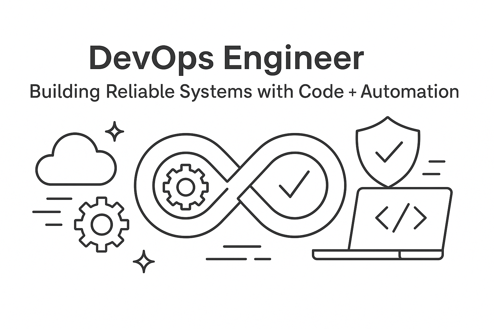

  

<h2 align="center">DevOps Engineer | Building Reliable Systems with Code + Automation</h2>

---

## 📘 DevOps Mastery Journal – 8 Week Journey

A structured, high-discipline journal documenting my daily DevOps learning over 8 weeks.

This repository contains:

- Daily progress logs  
- Hands-on command notes  
- Weekly summaries  
- Mini-project documentation  
- Linux, AWS, Docker, Terraform, CI/CD, Python & System Design fundamentals  

### 🔗 Repository Link  
👉 **[View DevOps Mastery Journal](https://github.com/kishan1988-hub/devops-mastery-journal)**

---

## 📌 Repository Snapshot

  

---

## 🎯 Purpose of This Journal

To build a strong foundation across key DevOps domains:

- Linux & Networking  
- AWS Core Services  
- Docker & Containers  
- Terraform (IaC)  
- GitHub Actions CI/CD  
- Python for Automation  
- Observability Tools  
- System Design Fundamentals  

This journal demonstrates:

- Consistency  
- Practical understanding  
- Clarity of thought  
- Hands-on skills  
- End-to-end DevOps fundamentals  

---

## 🧩 Tech Stack Focus  
`Linux` • `AWS` • `Terraform` • `Docker` • `GitHub Actions` • `Python`  
`CloudWatch` • `Prometheus` • `Grafana` • `Architecture`

---

## 📬 Open to Collaboration

If you're also working on DevOps learning or documentation — feel free to connect or follow the journey.

---
